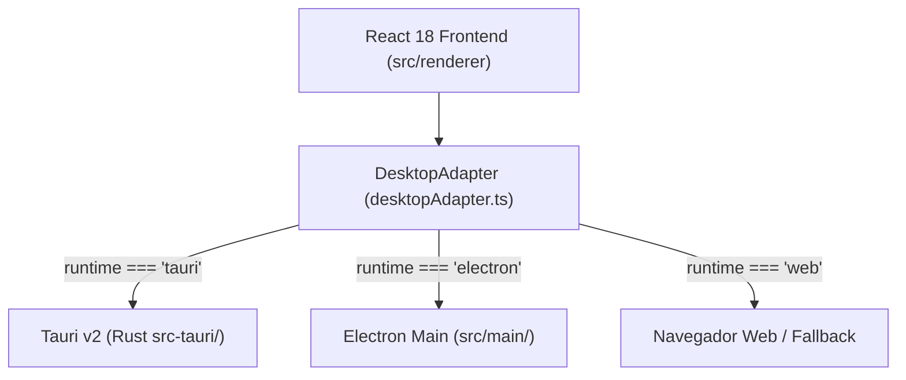

# Guia de Migração e Desenvolvimento - Tauri v2 (Nexus)

Este guia documenta a arquitetura, estrutura de arquivos e instruções de desenvolvimento para a transição da camada desktop do **Nexus** do Electron para o **Tauri v2**.

---

## 🏛️ Visão Geral da Arquitetura

O Nexus utiliza uma arquitetura **Dual-Adapter (Híbrida)**, onde a interface visual desenvolvida em **React 18 + TypeScript** permanece 100% inalterada, enquanto a camada de integração com o sistema operacional é gerenciada pela classe [`desktopAdapter.ts`](file:///c:/Users/paulo.ricardo/Documents/nexus/src/renderer/lib/desktopAdapter.ts).



---

## 📁 Estrutura de Arquivos Criados

```text
nexus/
├── src-tauri/
│   ├── Cargo.toml                 # Configuração de dependências Rust
│   ├── tauri.conf.json            # Configuração do aplicativo Tauri v2
│   ├── build.rs                   # Script de build nativo
│   ├── capabilities/
│   │   └── default.json           # Definição de permissões e segurança (Capabilities)
│   └── src/
│       ├── main.rs                # Entrypoint nativo
│       ├── lib.rs                 # Registro de plugins e command handlers
│       └── commands/
│           ├── mod.rs             # Exportação de comandos Rust
│           ├── sysinfo.rs         # Comando de informações do SO
│           └── logging.rs         # Comando de auditoria de logs
└── src/renderer/
    ├── lib/
    │   └── desktopAdapter.ts      # Camada de abstração unificada (IPC)
    └── __tests__/
        └── desktopAdapter.test.ts # Suíte de testes unitários do adapter
```

---

## 💻 Pré-requisitos para Desenvolvimento Local (Windows)

Para compilar e executar o Nexus com o Tauri v2 localmente:

1. **Instalar o Rust & Cargo:**
   - Baixar e executar o instalador oficial `rustup-init.exe` de [https://rustup.rs](https://rustup.rs).
   - Selecionar a opção padrão `1) Proceed with installation`.
2. **Microsoft C++ Build Tools:**
   - Garantir que o Visual Studio Build Tools com a carga de trabalho *"Desenvolvimento para Desktop com C++"* esteja instalado.

---

## 🛠️ Comandos de Desenvolvimento e Build

### Executar em Modo de Desenvolvimento
```bash
# Inicia o servidor frontend em http://localhost:3000 e a janela do Tauri v2
npm run tauri dev
```

### Compilar o Executável Portátil de Produção
```bash
# Gera o executável leve (~12MB) em src-tauri/target/release/bundle/
npm run tauri build
```

---

## 🔒 Segurança e Scoping (Security by Design)

As permissões do aplicativo são gerenciadas rigorosamente no arquivo `src-tauri/capabilities/default.json`:
- `notification:default`: Emissão de notificações nativas no Windows.
- `dialog:default`: Diálogos de seleção de arquivos.
- `fs:default`: Leitura e escrita restritas à pasta de dados do usuário.
- `updater:default`: Verificação automática de atualizações via GitHub Releases.
- `shell:allow-open`: Abertura de links externos de forma segura.
